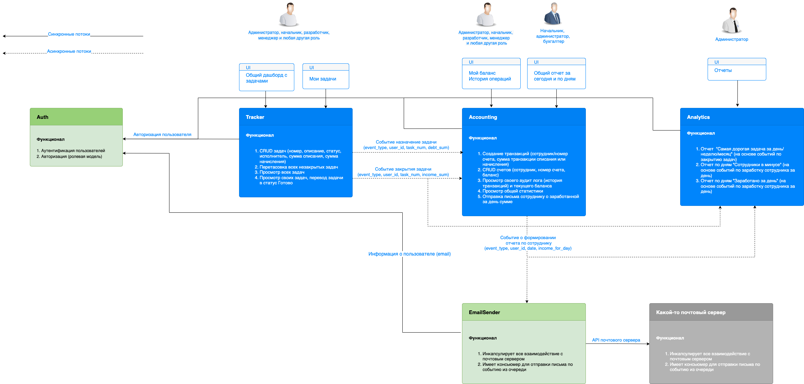

# Проект системы Awesome Task Exchange System (aTES)

# Логика разбиения на сервисы

1. **Сервис авторизации** - вынесен отдельно по требованиям. Позволяет единообразно подключать авторизацию к новому сервису без дублирования кода
2. Для бизнес-сервисов - смысл в конкретной доменной области и возможность предоставлять пользователям свой функционал  в случае деградации системы (даунтайм сервисов)
   1. **Сервис трекинга**. Доменная область - работа с задачами. Может работать и развиваться независимо от других
   2. **Сервис аккаунтинга**. Доменная область - финансы, счета и транзакции.  
   3. **Сервис аналитики**. Предоставление отчетов ограниченному кругу лиц.  

Сервисы tracking, accounting, analytics связаны между собой через асинхронные потоки, которые реализуются на основе очередей событий (например, кластер kafka). Это позволяет в случае падения одного из сервисов восстановить, например, историю транзакций, получить данные для отчетов.

Каждый сервис имеет свою БД, чтобы ограничить влияние друг на друга, независимо тюнить конкретную БД или переносить на другой сервер.

# Возможные проблемы и пути решения
1. Если **упадет сеть** - данные можно восстановить, т.к. очереди могут быть персистентными, и после восстановления сети события будут получены консьюмерами
2. Если **упадет один из сервисов** - данные восстанавливаются по накопленным событиям из очереди
3. Если **упадет БД** - восстановить предыдущее состояние из бэкапов, накатить события из очереди. БД брокера сообщений и сервисов должны быть на разных серверах. Если сервис забрал сообщение из очереди и не смог записать в БД, то варианты: 1) не подтверждать такое сообщение (для возможности повторной обработки) 2) сгенерировать событие об ошибке
4. Если **упадет брокер сообщений** - можно сгенерировать события заново. Например, для аккаунтинга - для каждого пользователя получить дату последней транзакции и для выполненных тасок позже этой даты сгенерировать заново события "Задача закрыта".
5. Если **упадет сервис авторизации** - пользователи перестанут генерировать новые события, с данными проблем быть не должно. Может быть проблема с отправкой email'а с отчетом пользователю (сервис не сможет получить email сотрудника для отчета). В этом случае EmailSender может создать событие "Не могу отправить email" или выполнить retry через некоторое время (вдруг auth поднимется)
